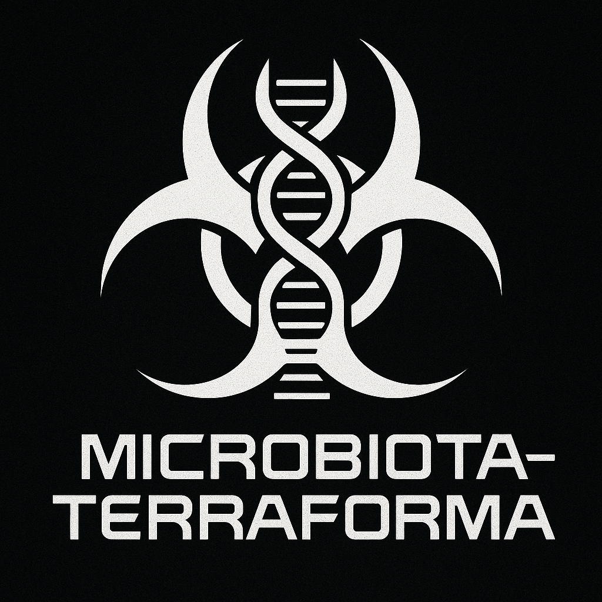

# 🧬 microbiota-terraforma

**A mechanistically driven home-lab experiment in microbiota terraforming.**

This repository contains research notes, experimental frameworks, and conceptual models aimed at reshaping my gut microbiota through mechanistically informed application of prebiotics, probiotics, postbiotics, and molecular precursors. It explores the suppression of pathogenic overgrowth, modulation of mucosal immunity, crypt colonization strategies, and long-term ecosystem stabilization.

This is an **ongoing, exploratory systems biology project** conducted outside formal institutional contexts, published in the spirit of transparency, curiosity, and open bioinformatics.

---

## ⚠️ Disclaimer

> **This repository does *not* provide medical advice.**

All content is for **research and educational purposes only.** The material here reflects:
- personal experiments and self-directed protocol development,
- speculative hypotheses grounded in mechanistic literature,
- exploratory use of publicly available supplements and ingredients.

Portions of this content are generated using large language models;
- therefore it may contain incompelte, incorrect or outright wrong information

No statements in this repository have been evaluated by the FDA (USA), EMA (EU), or any other regulatory body.  
**This work is not intended to diagnose, treat, cure, or prevent any disease.**

**By accessing or using any information in this repository, you agree that:**
- You assume full responsibility for any actions taken based on these notes.
- The author(s) are not liable for any harm, injury, or misapplication of the ideas presented.
- This content is shared "as is" under open documentation principles and is not a substitute for professional healthcare.

---

## 🧪 Project Scope

- **Biome Engineering**: Targeted modulation of the human gut microbiome using combinatory interventions.
- **Pre/Pro/Postbiotic Research**: Strain-specific behavior, cross-feeding pathways, immune conditioning.
- **Immune-Mucosal Interaction**: Mechanisms for tolerance signaling, crypt colonization, and barrier repair.
- **Protocol Development**: Iterative, phased frameworks for disrupting dysbiosis and enabling stable engraftment.
- **Home-Lab Systems**: Experimental methods using commercially available tools, fermented substrates, and precision scheduling—without pharmaceutical agents.

---

## 🧰 Key Sections (WIP)

- to do

---

## 🔐 Licensing

This repository is published under a permissive license to enable reuse and idea propagation—but not for commercial or clinical deployment.  
You may fork, adapt, or build upon this work with attribution and caution.

---

## 💬 Contact & Attribution
We are an OSDD 1.B system called: **High Tech System**

